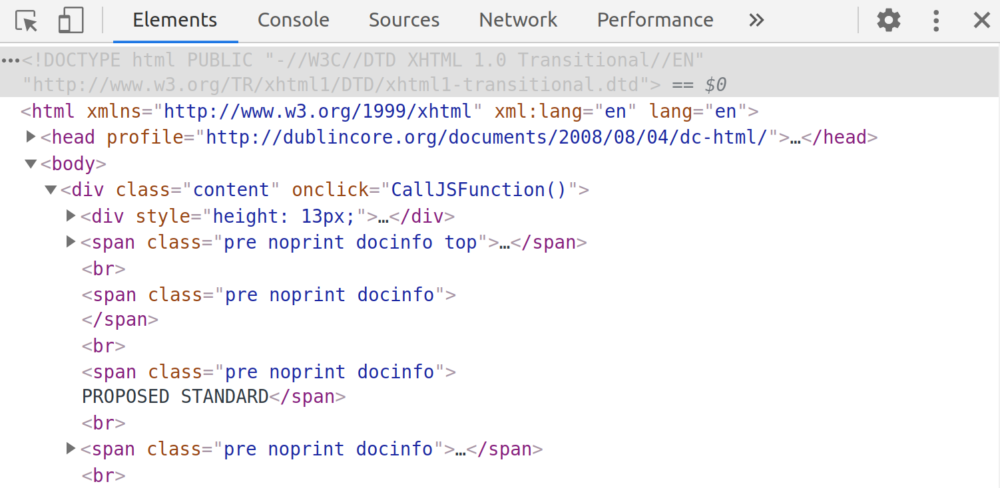
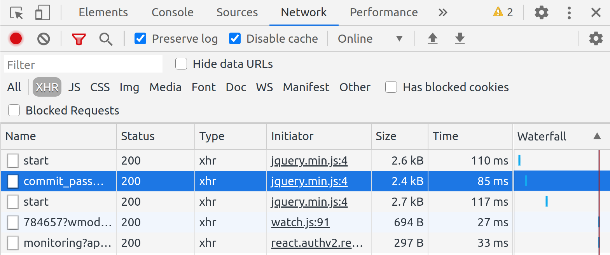
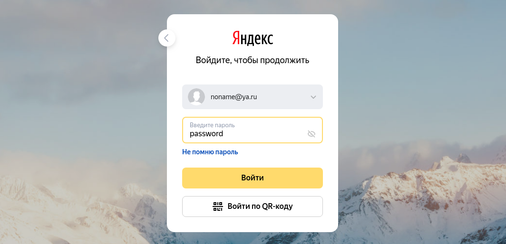
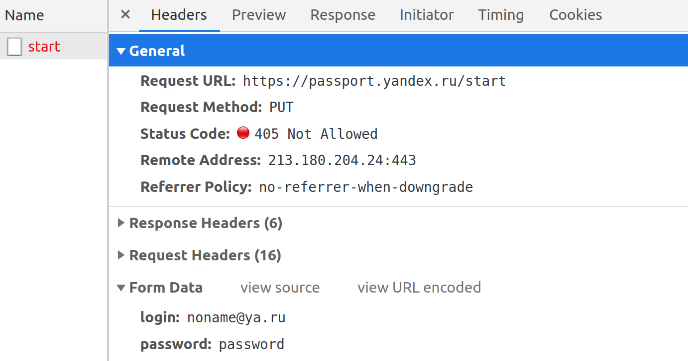
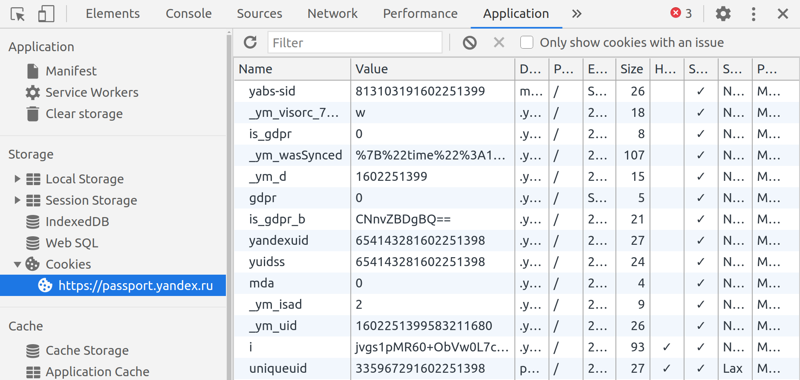

# Домашнее задание к занятию «Работа сети Интернет (часть 2): HTTP, HTTPS, HTTP2»

В качестве результата пришлите ответы на вопросы в личном кабинете студента на сайте [netology.ru](https://netology.ru).

## Nginx

TODO

## CTF*

**Важно**: эта задача не обязательная, её выполнение не влияет на получение (либо не получение) зачёта по ДЗ.

CTF (Capture The Flag) - одна из разновидностей "заданий" в мире ИБ.

Есть два типа:
* classic - классический, когда происходит деление на команды, которые одновременно защищают свои ресурсы и атакуют ресурсы условного противника
* task-based - решение набора задач, по итогам которого участники должны получить ключ (чаще всего это просто текст, представляющий собой текст, фразу, хэш, серийный номер и т.д.).

В чём будет состоять наша CTF:
1. Найти название первой JS-функцию, вызываемой в HTML-файле
2. Найти с помощью инструментов браузера метод, с помощью которого браузер отправляет данные при логине на сервисах Yandex
3. Определить название Cookie, который устанавливается для сохранения местоположения пользователя
4. Найти серийный номер сертификата сайта https://netology.ru

На каждый ответ вы получаете строку, которую затем используете в следующем виде:
http://localhost:9999/step1-answer/step2-answer/step3-answer.zip

Где:
* `step1-answer` - ответ на первый вопрос
* `step2-answer` - ответ на второй вопрос
* `step3-answer` - ответ на третий вопрос

В ответ вы получите zip-архив, паролем к которому будет служить ответ на четвёртый вопрос (важно: вводите номер сертификата без пробелов, в нижнем регистре и без двоеточий).

Для того, чтобы этот URL работал, вам необходимо скачать сервер для своей операционной системы:
* [Windows x86](assets/server-x32.exe)
* [Windows x64](assets/server-x64.exe)
* [Linux x86](assets/server-x32.bin)
* [Linux x64](assets/server-x64.bin)
* [Mac OS x64](assets/iserver-x64.bin)

И запускаете из командной строки в виде:
* Windows (x86): `.\server-x32.exe`
* Windows (x64): `.\server-x64.exe`
* Linux (x86): `chmod +x ./server-x86.bin && ./server-x86.bin`
* Linux (x64): `chmod +x ./server-x64.bin && ./server-x64.bin`
* Mac OS (x64): `chmod +x ./iserver-x64.bin && ./iserver-x64.bin`

Сервер запустится на порту 9999 (поэтому удостоверьтесь, что у вас на этом порту больше ничего не запущено).
* [Windows x86](assets/checker-x32.exe)
* [Windows x64](assets/checker-x64.exe)
* [Linux x86](assets/checker-x32.bin)
* [Linux x64](assets/checker-x64.bin)
* [Mac OS x64](assets/ichecker-x64.bin)

И запускаете из командной строки в виде:
* Windows (x86): `.\checker-x32.exe step1 FirstAnswer`
* Windows (x64): `.\checker-x64.exe step1 FirstAnswer`
* Linux (x86): `chmod +x ./server-x86.bin && ./server-x86.bin step1 FirstAnswer`
* Linux (x64): `chmod +x ./server-x64.bin && ./server-x64.bin step1 FirstAnswer`
* Mac OS (x64): `chmod +x ./iserver-x64.bin && ./iserver-x64.bin step1 FirstAnswer`

Где:
* `step1 answer` - ответ на первый вопрос
* `step2 answer` - ответ на второй вопрос
* `step3 answer` - ответ на третий вопрос
* `step4 answer` - ответ на четвёртый вопрос

Checker вам скажет, верен ответ или нет.

### Task 1

Откройте спецификацию протокола HTTP2 (RFC 7540) https://tools.ietf.org/html/rfc7540

И ответьте на вопрос: как называется первая функция JS, встречаемая в теле страницы, начиная с элемента `body`.

Описание выполнения

Как это делается? Открываете страницу в браузере, жмёте F12 и переходите на вкладку `Elements`:

Раскрываете элемент `body` и начиная с него идёте сверху вниз, пока не встретите конструкцию вроде `on*="Stuff()"`, где вместо `*` и `Stuff` могут быть любые строки.

Например, на скриншоте, это `onclick="CallJSFunction()"`, где `CallJSFunction` - это и будет название функции.

Проверяете в Checker'е: `./checker-x64.bin step1 CallJSFunction`.

### Task 2

Определите, каким HTTP-методом отправляется ваш пароль при входе в сервисы Яндекса.

Описание выполнения

Заходите на [https://passport.yandex.ru/auth/welcome](https://passport.yandex.ru/auth/welcome).

Открываете инструменты разработчика (F12) и переходите на вкладку Network (здесь вы сможете видеть все запросы, которые делает браузер для конкретной страницы), выставляете фильтр XHR:

Заполняете произвольными данными форму входа:

 
Нажимаете "Войти"

После чего смотрите в инструменты разработчика, выбирая последовательно запросы. Ищете тот, который появился после того, как вы нажали на кнопку "Войти". Для просмотра деталей, кликаете на нём левой кнопкой мыши:

В данном примере метод - `PUT`. Как удостовериться, что это именно тот запрос? Прокручиваете детали до самого низу и если внизу видите секцию `Form Data` с паролем, который вы вводили (а в других запросах этого пароля нет), то с большой долей вероятности, это то, что вам нужно.

### Task 3

Перейдите на страницу https://en.wikipedia.org/wiki/Cipher_suite и определите название Cookie, который устанавливается для сохранения вашего местоположения (города, страны).

Описание выполнения

Переходите на целевую страницу, открываете инструменты разработчика (F12) и переходите на вкладку Application (если она скрыта, то нужно "прокрутить" вкладки), выбираете раздел Cookie:

Видите все Cookie, которе устанавливает конкретный Origin (Origin - это кортеж из протокола, домена и номера порта). В данном случае он только один.

Выбирая Cookie, вы в нижней части страницы можете посмотреть их значения. Вам нужно найти такое, в котором будет зафиксирован код вашей страны, город и координаты.

### Task 4

Найдите серийный номер сертификата сайта https://netology.ru. Как это делать, вы разбирали на лекции.

Номер сертификата необходимо вводить без пробелов, двоеточий и в нижнем регистре.

### Результаты

В качестве результата пришлите ссылку, которая хранится в текстовом файле в архиве на веб-сервере.
